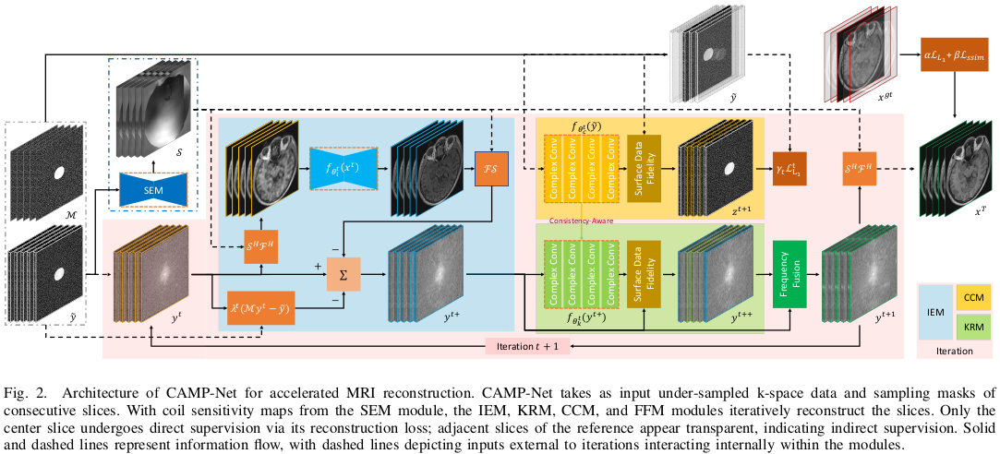

# CAMP-Net: Consistency-Aware Multi-Prior Network for Accelerated MRI Reconstruction
[Liping Zhang](https://lpzhang.github.io), [Xiaobo Li](https://scholar.google.com/citations?user=bP5Zb_kAAAAJ&hl=zh-CN), [Weitian Chen](http://www.diir.cuhk.edu.hk/profile/chen-weitian)

---

[](https://arxiv.org/abs/2306.11238)
[](https://github.com/lpzhang/CAMP-Net)
[](https://github.com/lpzhang/CAMP-Net/releases)

This repository is the official PyTorch implementation of "CAMP-Net: Consistency-Aware Multi-Prior Network for Accelerated MRI Reconstruction" ([arxiv](https://arxiv.org/abs/2306.11238), [supp](https://github.com/lpzhang/CAMP-Net/releases), [pretrained models](https://github.com/lpzhang/CAMP-Net/releases), [visual results](https://github.com/lpzhang/CAMP-Net/releases)). CAMP-Net achieves **state-of-the-art performance** in
- [Calgary-Campinas](https://sites.google.com/view/calgary-campinas-dataset/home) Multi-Coil Brain MR Raw Data
- [SKM-TEA](https://github.com/StanfordMIMI/skm-tea) Multi-Coil Knee MR Raw Data
- [fastMRI](https://fastmri.med.nyu.edu/) Multi-Coil Knee MR Raw Data

</br>

## Updates
- [2023/03/25] 🥈 We secured 2nd place in 4x accelerated Multi-Coil Knee reconstruction in [fastMRI Leaderboard](https://web.archive.org/web/20230324102125mp_/https://fastmri.org/leaderboards)!
- [2023/03/25] 🥉 We secured 3rd place in 8x accelerated Multi-Coil Knee reconstruction in [fastMRI Leaderboard](https://web.archive.org/web/20230324102125mp_/https://fastmri.org/leaderboards)!

<p align="center">
 
</p>

## Citation
```bibtex
@article{zhang2023camp,
  title={CAMP-Net: Consistency-Aware Multi-Prior Network for Accelerated MRI Reconstruction},
  author={Zhang, Liping and Li, Xiaobo and Chen, Weitian},
  journal={arXiv preprint arXiv:2306.11238},
  year={2023}
}
```

## License and Acknowledgement
This project is released under the Apache 2.0 license. The codes are based on [fastMRI](https://github.com/facebookresearch/fastMRI), [MC-MRI-Rec](https://github.com/rmsouza01/MC-MRI-Rec), and [SKM-TEA](https://github.com/StanfordMIMI/skm-tea). Please also follow their licenses. Thanks for their awesome works.

## Contents
<p align="center">

</p>

Coming soon ...

